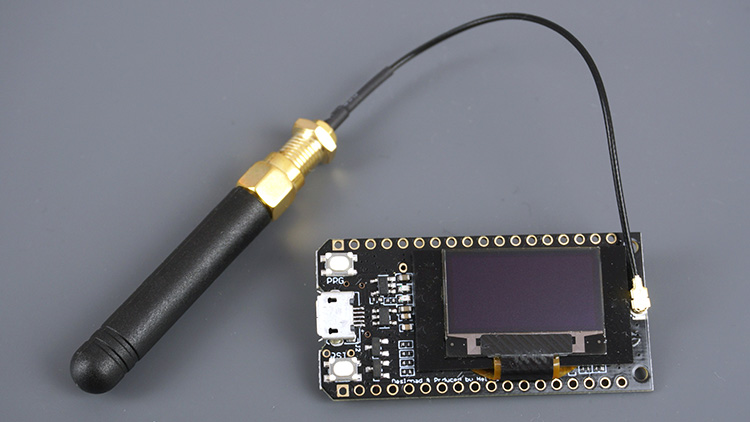
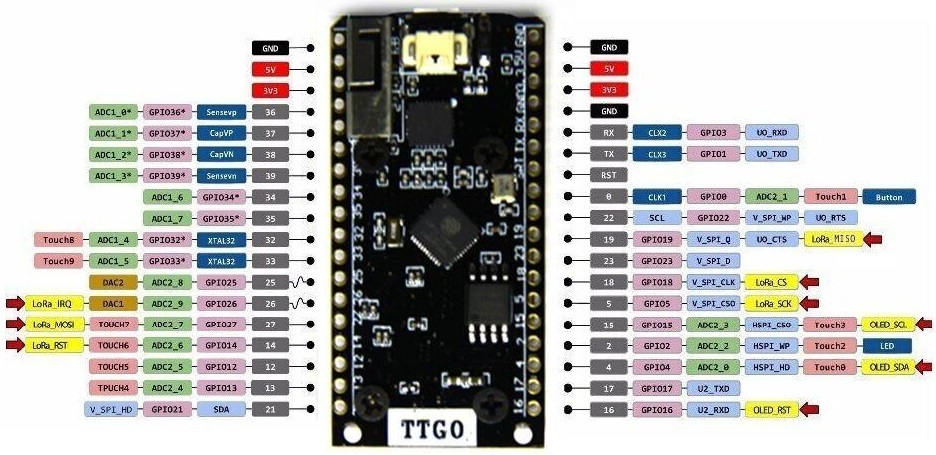

# TTN-Apeldoorn P1-Node Hardware

## TTN-Apeldoorn P1-Node Hardware settings
THe board has tree hardware settings:
JP1: selection between hard and software serial, default soft serial
=> You must use Hardware Serial if baudrate > 57.6K
JP2: selection between soft and hard request, default hard request.
=> Data_Req signal to P1 is always high (reading active)
JP3: Selection between yes/no change polarity.

## TTGO LoRa32 SX1276 OLED Overview
The TTGO LoRa32 SX1276 OLED is a development board with an ESP32, a built-in LoRa chip and an SSD1306 OLED display.

## TTGO LoRa32 SX1276 OLED Pins
The following figure shows the TTGO LoRa32 OLED board pinout.

The OLED displays communicates using I2C communication protocol. It is internally connected to the ESP32 on the following pins:
* SDA	GPIO 4
* SCL	GPIO 15
* RST	GPIO 16

The SX1276 LoRa chip communicates via SPI communication protocol, and it is internally connected to the ESP32 on the following GPIOs:
* MISO	GPIO 19
* MOSI	GPIO 27
* SCK	GPIO 5
* CS	GPIO 18
* IRQ	GPIO 26
* RST	GPIO 14

There are several libraries available to control the OLED display with the ESP32. In this tutorial we’ll use two Adafruit libraries: Adafruit_SSD1306 library and Adafruit_GFX library.

Follow the next steps to install those libraries.

1. Open your Arduino IDE and go to Sketch > Include Library > Manage Libraries. The Library Manager should open.
2. Type “SSD1306” in the search box and install the SSD1306 library from Adafruit.
3. After installing the SSD1306 library from Adafruit, type “GFX” in the search box and install the library.

