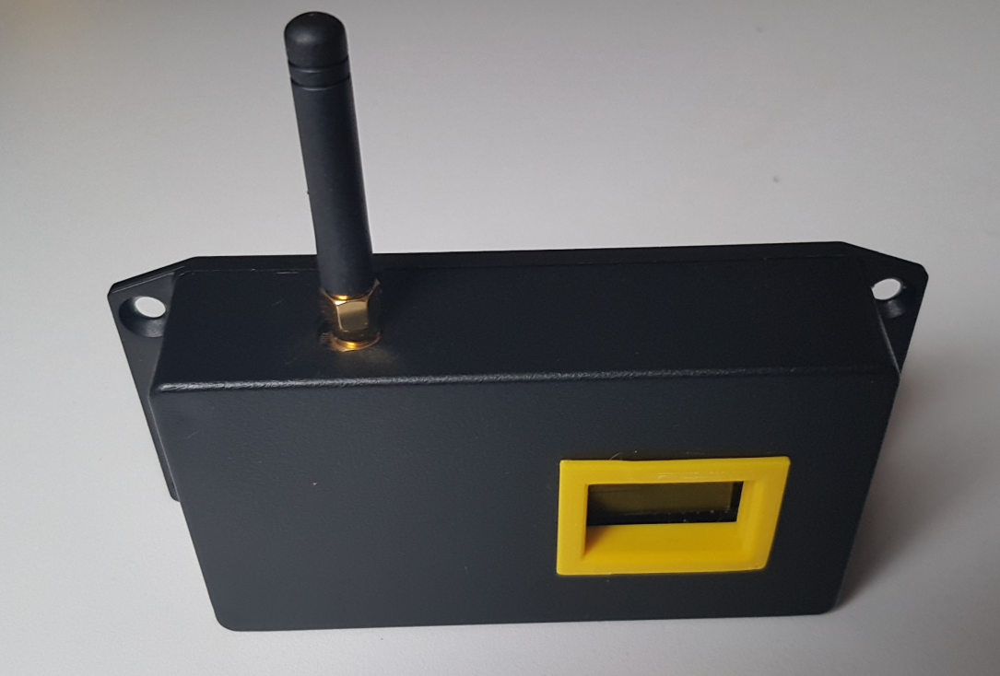

# TTN-Apeldoorn P1-Node
This is the P1-Node of TTN-Apeldoorn. The P1-Node is a LoRaWAN device that will read the information from intelligent energy meters (<a href="https://nl.wikipedia.org/wiki/Slimme_meter" target="_blank">slimme meters</a>) that have a P1-interface. 

The node is designed for a LILYGO TTGO LORA32 868 Mhz ESP32 LoRa OLED node. 

## About the project
The <a rel="TTN-Apeldoorn community" href="https://www.thethingsnetwork.org/community/apeldoorn/">TTN-Apeldoorn community</a> is an active community since 2017. By organising <a rel="TTN-Apeldoorn meetups" href="https://www.meetup.com/LoRa-Network-in-Apeldoorn-Growing-Meetup/">meetups</a> and projects for the community members a large group of IoT enthousiasts are regulary informed about a wide range of IoT topics and developments. With projects like <a rel="Apeldoorn in data" href="Apeldoorn in data">Apeldoorn in data</a>, TTN-Apeldoorn is involved in Citizen science projects of the township Apeldoorn. For one of the projects of Apeldoorn the P1-Node is developed and deliverde in a serie of 10 sensors.

The P1-Node is designed with reproduction by less experienced community members in mind. Although trough-hole-components are more easily to be solders by these community members the P1-Node is designed using SMD components. The chosen SMD components are the biggest possible (1206) that can be hand soldered. Also it is possible to introduce reflow techniques to the community members that they actually can do them selves. 

It is planned to deliver a project to TTN-Apeldoorn community in which the members can build their own P1-Node.

## About this repository
This repository holds all information te build de P1-Node. 

# Disclaimer
The documentation of the TTN-Apeldoorn P1-Node is distributed in the hope that it will be useful, but WITHOUT ANY WARRANTY; without even the 
implied warranty of MERCHANTABILITY or FITNESS FOR A PARTICULAR PURPOSE.

# License
The TTN-Apeldoorn P1-Node node is free soft- and hardware:
you can redistribute and/or modify it under the terms of a Creative Commons Attribution-NonCommercial 4.0 International License (http://creativecommons.org/licenses/by-nc/4.0/) by TTN-Apeldoorn (https://www.thethingsnetwork.org/community/apeldoorn/) E-mail: ttnapeldoorncoreteam@rfsee.nl

 This work is licensed under a <a rel="license" href="http://creativecommons.org/licenses/by-nc/4.0/">Creative Commons Attribution-NonCommercial 4.0 International License</a>.