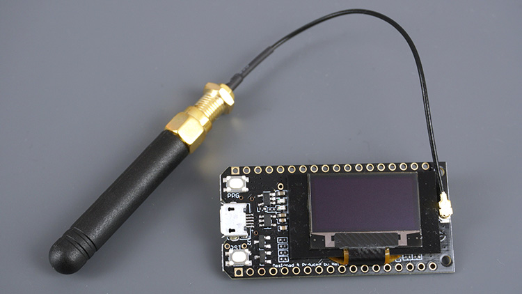

# TTN-Apeldoorn P1-Node Hardware settings
THe board has tree hardware settings:
JP1: selection between hard and software serial, default soft serial
=> You must use Hardware Serial if baudrate > 57.6K
JP2: selection between soft and hard request, default hard request.
=> Data_Req signal to P1 is always high (reading active)
JP3: Selection between yes/no change polarity.

## TTGO LoRa32 SX1276 OLED Overview

The TTGO LoRa32 SX1276 OLED is a development board with an ESP32, a built-in LoRa chip and an SSD1306 OLED display.
